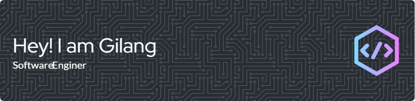

  
  

    
    
  

  

---

  
### :octocat: About Me
  
- 🌍  I'm based in Magetan, Indonesia
- ✉️  You can contact me at [al.gilang.p@gmail.com](mailto:al.gilang.p@gmail.com)
- 🤝  I'm open to collaborating on interesting JavaScript projects

<!--
- 🌍  I'm based in London, England
- 🖥️  See my portfolio at [peterparker.com](http://peterparker.com)
- ✉️  You can contact me at [peter@pparker.com](mailto:peter@pparker.com)
- 🚀  I'm currently working on [peterparker.com](http://peterparker.com)
- 🧠  I'm learning a new JavaScript framework
- 🤝  I'm open to collaborating on interesting JavaScript projects
- ⚡  I moonlight as a super hero
 --> 

---

  
  ### :hammer_and_wrench: Languages and Tools

  

---

  ### :fire: My Stats
  
  
  

<!--
**agilangp/agilangp** is a ✨ _special_ ✨ repository because its `README.md` (this file) appears on your GitHub profile.

Here are some ideas to get you started:

- 🔭 I’m currently working on ...
- 🌱 I’m currently learning ...
- 👯 I’m looking to collaborate on ...
- 🤔 I’m looking for help with ...
- 💬 Ask me about ...
- 📫 How to reach me: ...
- 😄 Pronouns: ...
- ⚡ Fun fact: ...
-->
